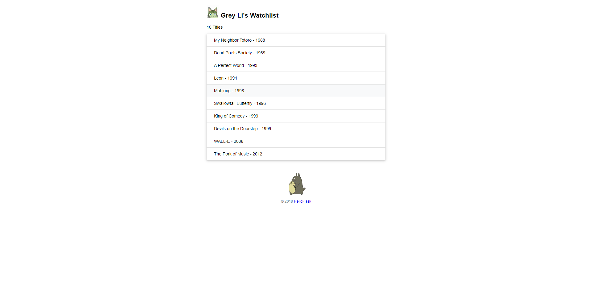
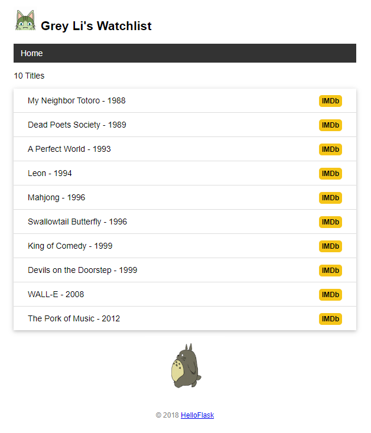
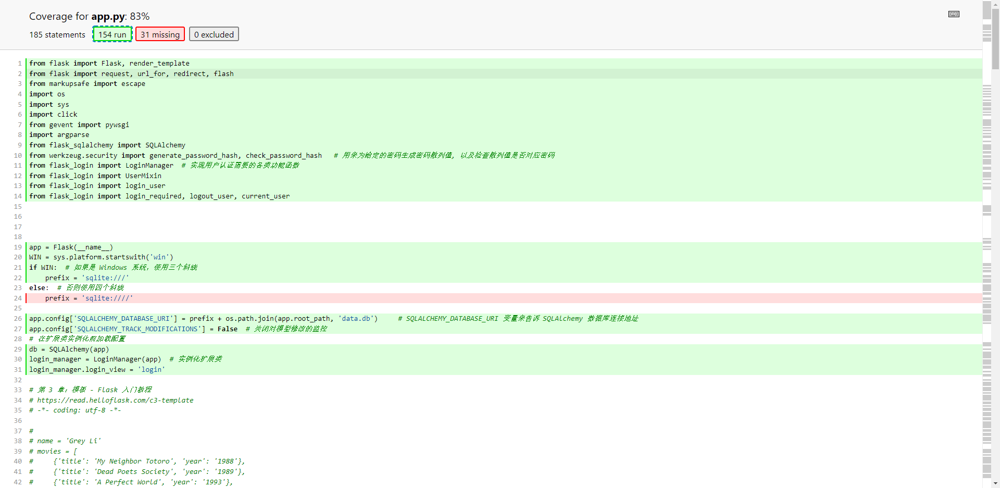

# flask_tutorial
https://tutorial.helloflask.com/form/

# requirements
```shell
cffi==1.15.1
click==8.0.4
colorama==0.4.5
coverage==6.2
dataclasses==0.8
Flask==2.0.3
Flask-Login==0.5.0
Flask-SQLAlchemy==2.5.1
gevent==21.12.0
greenlet==1.1.2
importlib-metadata==4.8.3
itsdangerous==2.0.1
Jinja2==3.0.3
MarkupSafe==2.0.1
pycparser==2.21
python-dotenv==0.20.0
SQLAlchemy==1.4.39
typing_extensions==4.1.1
Werkzeug==2.0.3
zipp==3.6.0
zope.event==4.5.0
zope.interface==5.4.0


```

```shell
pip install -r requirements.txt
```

# 运行
```shell
$flask_tutorial# flask run

```
# chapter
## chapter4



## chapter5
```shell
flask forge
flask run
```

# chapter 6


第 5 章：数据库 - Flask 入门教程
https://tutorial.helloflask.com/database/

# 登录账号密码

username:admin
password:123

# chapter 9 

```shell
(env) $ python test_watchlist.py

```

```shell
(env) $ pip install coverage
(env) $ coverage run --source=app test_watchlist.py
```
```shell
(venv) D:flask_tutorial>python test_watchlist.py
...............
----------------------------------------------------------------------
Ran 15 tests in 3.335s

OK
```
返回 ok，表示测试通过
返回 failed，表示有测试不通过

```SHELL
(venv) D:\flask_tutorial>coverage report
Name     Stmts   Miss  Cover
----------------------------
app.py     185     31    83%
----------------------------
TOTAL      185     31    83%

```
Miss: 代表没有测试到的代码行数


```shell
coverage html
# htmlcov/app_py.html   浏览器打开
```



# chapter 10 组织你的代码

**旧的代码**  
见 app.py

**新的代码**


程序入口地址
wsgi.py

在调试工具，进行调试的时候，需要对 `wsgi.py` 中的如下部分，取消注释
```PYTHON
app.run(host="127.0.0.1", port=5004, debug=True)
```

目前的项目文件结构：
```shell

├── .flaskenv
├── app.py
├── test_watchlist.py
├── static
│   ├── favicon.ico
│   ├── images
│   │   ├── avatar.png
│   │   └── totoro.gif
│   └── style.css
└── templates
    ├── 400.html
    ├── 404.html
    ├── 500.html
    ├── base.html
    ├── edit.html
    ├── index.html
    ├── login.html
    └── settings.html
```


修改之后的目录结构
```shell
├── .flaskenv
├── test_watchlist.py
└── watchlist  # 程序包
    ├── __init__.py
    ├── commands.py
    ├── errors.py
    ├── models.py
    ├── views.py
    ├── static
    │   ├── favicon.ico
    │   ├── images
    │   │   ├── avatar.png
    │   │   └── totoro.gif
    │   └── style.css
    └── templates
        ├── base.html
        ├── edit.html
        ├── errors
        │   ├── 400.html
        │   ├── 404.html
        │   └── 500.html
        ├── index.html
        ├── login.html
        └── settings.html
```

# References
[Flask 入门教程](https://tutorial.helloflask.com/)